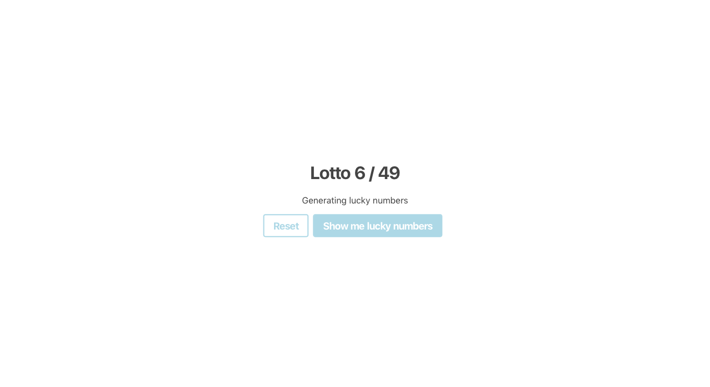

# Lotto numbers

Let's create a `LuckyNumbers` component in the provided file `src/components/LuckyNumbers/index.js`

It should display 2 buttons.

On click on "Show me lucky numbers" 6 numbers between 1 and 49 should be generated and displayed. All of the 6 numbers must be unique.

In addition one number between 1 and 10 should be generated and displayed. Every time you click the button a new set of lucky numbers should be generated and displayed.

On clicking on the "Reset" button all numbers should be removed.

[//]: # (autograding info start)
#  Results
> ⌛ Give it a minute. As long as you see the orange dot  on top, CodeBuddy is still processing. Refresh this page to see it's current status.
>
> This is what CodeBuddy found when running your code. It is to show you what you have achieved and to give you hints on how to complete the exercise.

### LuckyNumbers Component

|                 Status                  | Check                                                                                    |
| :-------------------------------------: | :--------------------------------------------------------------------------------------- |
|  | 'Show me lucky numbers' button exists |
|  | Clicking 'Show me lucky numbers' creates seven numbers from 1 to 49 |
|  | Last number (super number) is always between 1 and 10 |
|  | Every click on 'Show me lucky numbers' creates unique numbers |
|  | 'reset' button exists |
|  | 'reset' button removes lucky numbers |

[🔬 Results Details](../../actions)
[🐞 Tips on Debugging](https://github.com/DCI-EdTech/autograding-setup/wiki/How-to-work-with-CodeBuddy)
[📢 Report Problem](https://docs.google.com/forms/d/e/1FAIpQLSfS8wPh6bCMTLF2wmjiE5_UhPiOEnubEwwPLN_M8zTCjx5qbg/viewform?usp=pp_url&entry.652569746=SPA-components-state-lotto)

[//]: # (autograding info end)