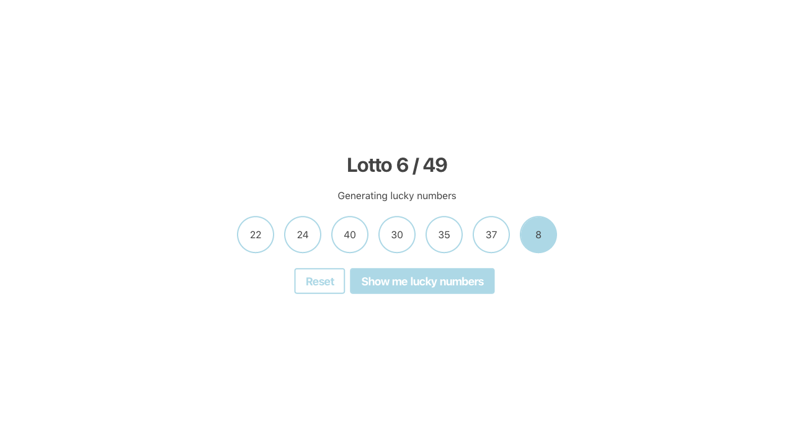

# Lottozahlen

Lass uns eine `LuckyNumbers` Komponente erstellen.

Sie sollte 2 Schaltflächen anzeigen.

Wenn du auf einen davon klickst (Show me lucky numbers), sollen 6 Zahlen zwischen 1 und 49 generiert und angezeigt werden. Jede der 6 Zahlen muss einzigartig sein.

Außerdem soll eine Zahl zwischen 1 und 10 generiert und angezeigt werden. Jedes Mal, wenn du auf die Schaltfläche klickst, sollte eine neue Reihe von Glückszahlen generiert und angezeigt werden.

Wenn du auf die Schaltfläche Reset klickst, sollten alle Zahlen ausgeblendet werden.

[//]: # (autograding info start)
## Ergebnisse

### Zufallszahlengenerator implementieren

| Status | Prüfen |
| :-------------------------------------: | :--------------------------------------------------------------------------------------- |
|  | 'Show me lucky numbers' Schaltfläche existiert |
|  | Ein Klick auf 'Show me lucky numbers' erzeugt sieben Zahlen von 1 bis 49 |
|  | Letzte Zahl (Superzahl) liegt immer zwischen 1 und 10 |
|  | Jeder Klick auf 'Show me lucky numbers' erzeugt einzigartige Zahlen |
|  | 'Reset'-Button existiert |
|  | 'reset' Schaltfläche entfernt Glückszahlen |

[Ergebnisdetails](https://github.com/DigitalCareerInstitute/SPA-components-state-lotto/actions)

### Debugging deines Codes
> [Lesen der Testausgaben](https://github.com/DCI-EdTech/autograding-setup/wiki/Reading-test-outputs)

Es gibt zwei Möglichkeiten, um herauszufinden, warum Aufgaben nicht abgeschlossen werden können:
#### 1. Tests lokal ausführen
- Führe `npm install` aus
- Führe `npm test` im Terminal aus. Du wirst sehen, wo deine Lösung vom erwarteten Ergebnis abweicht.

#### 2. Überprüfen der Testausgabe auf GitHub
- Gehe auf die [Registerkarte Aktionen deines Übungsrepos](https://github.com/DigitalCareerInstitute/SPA-components-state-lotto/actions)
- Dort siehst du eine Liste mit den Testläufen. Klicke auf den obersten.
- Klicke auf "Autograding".
- Erweitere den Punkt 'Run DCI-EdTech/autograding-action@main'
- Hier siehst du alle Ausgaben des Testlaufs

[//]: # (autograding info end)
